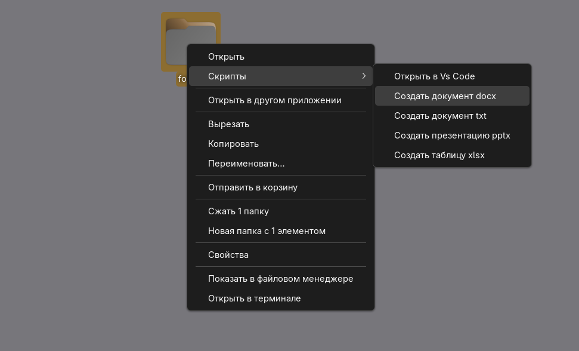

# Быстрые действия из контекстного меню

Этот набор сценариев позволяет в файловом менеджере Nautilus и на рабочем столе (при использовании расширения _Desktop Icons Ng (DING)_) **правой кнопкой мыши** по папке:

- **Открыть текущую папку в VS Code**
- **Создать документ в папке**:
  - `.docx` (документ)
  - `.txt` (обычный текстовый документ)
  - `.pptx` (презентация)
  - `.xlsx` (таблица)

## Установка

**Склонируйте репозиторий:**
```bash
git clone https://github.com/pbarovsky/nautilus-scenarios.git
```

**Перейдите в директорию:**
```bash
cd nautilus-scenarios
```

**Вы можете установить сценарии использую исполняемый файл `install.sh`:**

```bash
chmod +x ./install.sh && ./install.sh
```

### Установка вручную

1. **Создайте папку скриптов Nautilus**:

```bash
mkdir -p ~/.local/share/nautilus/scripts/
```

2. **Скопируйте скрипты**:

```bash
cp -v scripts/* ~/.local/share/nautilus/scripts/
```

3. **Создайте папку шаблонов:**

```bash
mkdir -p ~/.local/share/file-templates/
```

4. **Скопируйте шаблоны документов**

```bash
cp -v file-templates/* ~/.local/share/file-templates/
```

5. **Сделайте скрипты исполняемыми:**

```bash
chmod +x ~/.local/share/nautilus/scripts/*
```

6. **Перезапустите Nautilus:**

```bash
nautilus -q
```

## Примеры работы сценариев

<p align="center">  <br> <em>Пример на рабочем столе</em> </p>


>[!IMPORTANT]
> Все действия проверены на Alt Linux (sisyphus) со средой рабочего окружения Gnome

>[!NOTE]
> После установки можете удалить склонированную папку